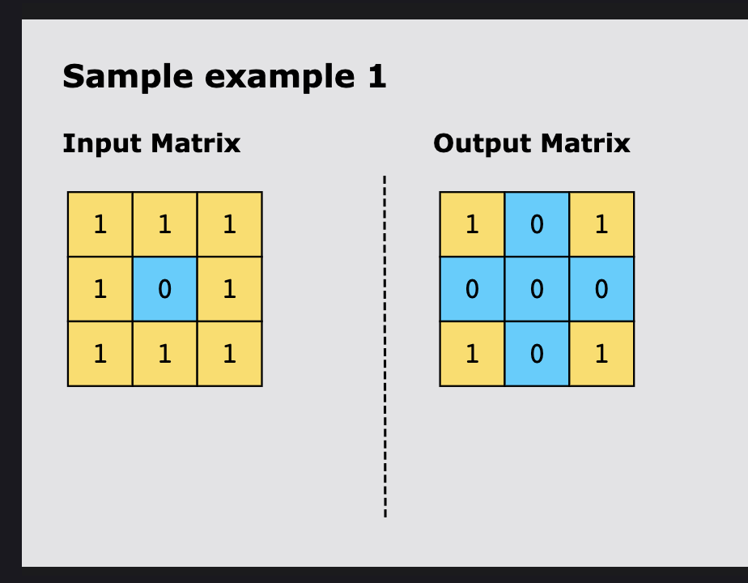

### Introduction to Matrices

1. A matrix is a group of numbers arranged in rows and columns in a rectangular pattern.
2. m * n matrix indicates m rows and n columns.
3. Each element in the matrix can be accessed using the array indexes. 
4. [7,2] as 2-D array [[7],[2]] 
* [[0 1 3 ], [9,5,8]] as 2-D array (2*3)

## Problems 

## Set Matrix Zeroes : 
* Given a matrix, mat, if any element within the matrix is zero, set that row and column to zero. The performed operations should be in place, i.e., the given matrix is modified directly without allocating another matrix.



1. ### Brute Force : 
* Iterate over the complete matrix using for loops (m,n)
* Mark Row: As soon as you encounter a zero in a row, mark all columns in that row as -1 (dummy)
* Mark column: As soon as you encounter a zero in a column, mark all rows in that column as -1 (dummy)
* Outer loop : Replace -1 (or any other dummy) with 0. 
```python
# Brute force approach:
#Always show details
def setZeroes_bruteforce(matrix):
    m, n = len(matrix), len(matrix[0])

    for i in range(m):             # 3
        for j in range(n):         # 3 
            if matrix[i][j] == 0:  # If we encounter any 0 
                # mark row
                for k in range(n):  # The loop is till n bevause we have to put dummy in all columns for that row (same row)
                    if matrix[i][k] != 0:
                        matrix[i][k] = -1
                # mark col
                for k in range(m):   # The loop is till m because we have to put dummy in all rows (same column)
                    if matrix[k][j] != 0:
                        matrix[k][j] = -1

    # final pass to convert -1 to 0
    for i in range(m):
        for j in range(n):
            if matrix[i][j] == -1:
                matrix[i][j] = 0      # Replacing -1 by 0
    return matrix

if __name__ == "__main__":
    # Test case
   matrix = [
    [1, 2, 3],
    [4, 0, 6],
    [7, 8, 9]
]

   result = setZeroes_bruteforce(matrix)
   print(result)


# Time Complexity 

Time: O(m * n * (m + n)) → for every zero, we scan its row & col.
Space: O(1) (ignoring placeholder marking).
```

2. Better approach with extra memory
* Add index of rows and columns where you see 0 to a set. 
* Traverse again if index of row or column is in set then set matrix[i][j]=0
```python
def setZeroes_better(matrix):
    m, n = len(matrix), len(matrix[0])
    rows, cols = set(), set()

    for i in range(m):
        for j in range(n):
            if matrix[i][j] == 0:
                rows.add(i)
                cols.add(j)

    for i in range(m):
        for j in range(n):
            if i in rows or j in cols:  # This will give True or False
                matrix[i][j] = 0

    return matrix


if __name__ == "__main__":
    # Test case
   matrix = [
    [1, 2, 3],
    [4, 0, 6],
    [7, 8, 9]
]

   result = setZeroes_better(matrix)
   print(result)

# Time & Space Complexity
Time: O(m * n)
Space: O(m + n) (for row/col sets)
```


